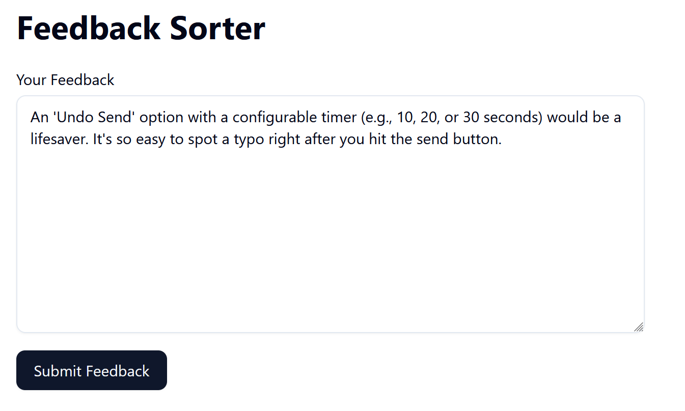
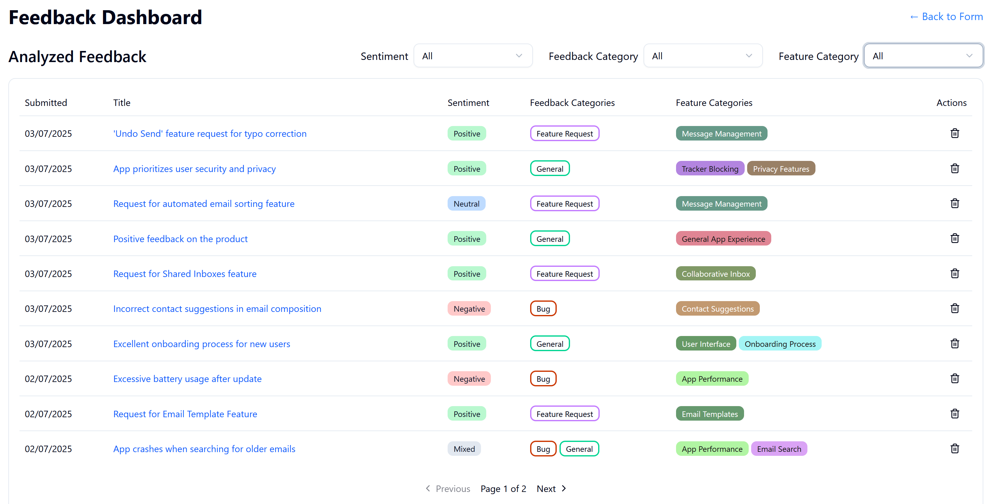
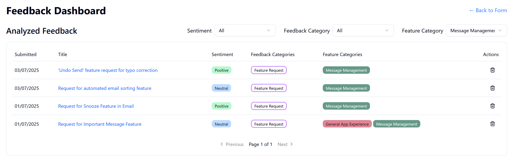

As a developer looking to showcase modern software architecture patterns and AI integration, I built **FeedbackSorter** - a proof-of-concept application that demonstrates how Large Language Models (LLMs) can transform raw user feedback into actionable insights. This portfolio project combines clean architecture principles with intelligent automation to solve the common problem of managing and categorizing large volumes of user feedback.

## What FeedbackSorter Does

FeedbackSorter is an intelligent feedback management system that accepts free-form text feedback from users and automatically analyzes it using AI. The system extracts meaningful insights from each piece of feedback, including:

- **Sentiment Analysis** - Determines whether feedback is positive, negative, neutral, or mixed
- **Feedback Categorization** - Classifies feedback as bug reports, feature requests, or general feedback
- **Feature Identification** - Identifies which product features the feedback relates to
- **Title Generation** - Creates concise titles for better organization and browsing

The application consists of a simple yet effective interface with two main views:

1. **Feedback Submission Form** - A clean interface where users can enter their feedback
2. **Feedback Dashboard** - A comprehensive view of all analyzed feedback with filtering and sorting capabilities



Users can submit feedback through a simple form, and the system immediately acknowledges receipt while processing the analysis in the background.



The dashboard presents all analyzed feedback in a sortable, filterable table that makes it easy to browse through potentially hundreds of feedback entries.

## The Power of Smart Categorization

One of the most valuable features is the intelligent feature categorization system. When users provide feedback about different aspects of a product, the AI automatically identifies which features are being discussed. The system maintains a dynamic list of feature categories, reusing existing ones when appropriate and creating new ones when needed.



This allows product managers to quickly filter feedback by specific features, making it easy to identify patterns and prioritize improvements.

## The Prompt Engineering Behind the Magic

The heart of FeedbackSorter lies in its sophisticated prompt engineering. The system uses Microsoft's Semantic Kernel to integrate with OpenRouter.ai, providing access to various LLM models. The prompt is carefully crafted to ensure consistent, structured output:

````
You are an AI assistant that analyzes user feedback of a product.
Analyze the following user feedback and categorize it based on the provided feature categories.
Return the analysis in a JSON format.

User Feedback:
```
{feedbackText.Value}
```

Existing Feature Categories: [{existingCategories}],

Expected JSON Output Format:
```json
{
  "Title": "Summarized title of the feedback",
  "Sentiment": "Positive|Negative|Neutral|Mixed|",
  "FeedbackCategories": ["Bug", "FeatureRequest", "General"],
  "FeatureCategoryNames": ["Some Feature", "Another Feature"]
}
```

- Ensure the JSON is valid and strictly adheres to the specified format.
- If you cannot determine a suitable Feedback Category, use "Other".
- Think what you might call the feature the feedback is about. Either pick existing feature
  categories based on the provided list of existing feature categories, or create new ones if
  no suitable categories exist. The Feature category names should be succinct, 1-4 words. 
- Do not include any other text or explanation outside the JSON block.

Example:
Given this feedback:
```
Hi,
I cannot recover my password. On the login page, when I click the 'password recovery'
link, the site says it has sent me an email, but I never received one.
Let me know if you need any further details.
```
The analysis outcome might look something like this:
```json
{
   "Title": "Recover Password functionality is broken",
   "Sentiment": "Neutral",
   "FeedbackCategories": ["Bug"],
   "FeatureCategoryNames": ["Login Page", "Password Recovery"]
}
```
If the user feedback cannot be analyzed, for example, it is complete gibberish, return
a string in the following format:
```
Error: Description of the problem
```
````


The prompt includes several key elements:

1. **Context Setting** - Clearly establishes the AI's role as a feedback analyzer
2. **Existing Categories** - Provides the current list of feature categories to encourage reuse and consistency
3. **Structured Output** - Defines the exact JSON format expected
4. **Examples** - Includes concrete examples showing how different types of feedback should be analyzed
5. **Error Handling** - Provides fallback instructions for edge cases

The system includes robust error handling and response parsing, extracting JSON from markdown code blocks and validating the structure before processing.

## Key Features That Make It Practical

**Background Processing**: Feedback analysis happens asynchronously, so users get immediate confirmation of submission without waiting for AI processing.

**Intelligent Deduplication**: The system actively tries to reuse existing feature categories rather than creating duplicates, helping maintain a clean categorization system.

**Comprehensive Filtering**: The dashboard supports filtering by sentiment, feedback type, and feature categories with server-side processing for performance.

**Error Recovery**: Failed analyses are tracked separately with retry functionality, ensuring no feedback is lost.

## Real-World Applications

While this is a proof-of-concept, the patterns and approaches used in FeedbackSorter could easily be adapted for production use cases:

- **Product feedback management** for SaaS applications
- **Customer support ticket categorization** 
- **Survey response analysis** for market research
- **App store review analysis** for mobile applications

## Try It Yourself

FeedbackSorter is open source and available on GitHub at [https://github.com/kbjorklid/FeedbackSorter](https://github.com/kbjorklid/FeedbackSorter). The project includes comprehensive documentation for setup and testing, making it easy to explore the codebase and experiment with different LLM integrations.

Whether you're interested in AI integration patterns, clean architecture implementation, or just want to see how modern .NET applications can be structured, FeedbackSorter provides a practical example of bringing these concepts together to solve real problems.

The combination of intelligent automation and thoughtful UX design shows how AI can enhance rather than replace human decision-making, making large volumes of user feedback manageable and actionable.